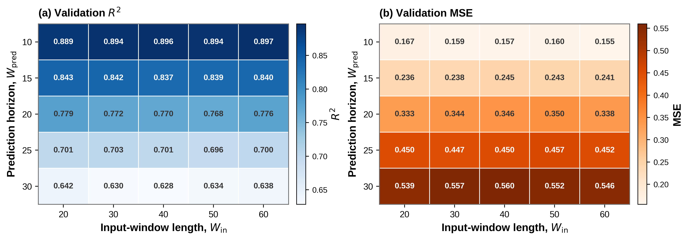

<div align="center">

# Correct-and-then-Detect
### Adaptive Fault Detection through Data-driven Digital Twins and Transfer Learning

**Haibo Li · Zhiguo Zeng · Hu Yang · Xu Li**


[Paper](2nd_rev/manuscript_r2/manuscript_r2.pdf) · [Second-round response](2nd_rev/response_letter_r2/response_letter_r2.pdf) · [Method](#method) · [Reproduce](#reproduce) · [Paper ↔ Code ↔ Results](docs/PAPER_CODE_RESULTS.md) · [Audit](docs/VALIDATION.md) · [Contributors](#contributors)


</div>

Research implementation integrating design of experiments, a rolling data-driven digital twin, transfer learning and prediction-based recursive observation feedback (PROF). The experiments use an LSTM temperature forecaster on two robotic platforms. The contribution concerns the integrated modeling, adaptation and feedback process.

## Method

1. **Design experiments** to cover the feasible pick-and-place task space.
2. **Learn a nominal digital twin** from healthy source measurements.
3. **Adapt the predictor** with healthy target data and layer freezing.
4. **Detect faults** against the immutable raw observation. PROF replaces flagged observations only in the feedback stream used by subsequent rolling windows.

Evaluation uses 30 historical observations, a 10-step forecast and the final forecast horizon. The source-calibrated threshold is 1.8 °C. Seeds 42–46 quantify target-domain variation.

## Results




Released weights reproduce all 80 target-data detection configurations, all 20 factorial configurations and the 61-threshold source validation curve. The updated window-sensitivity study trains 75 new 64-unit LSTMs: 25 history/horizon combinations × seeds 42, 43, 44, evaluated at the same 12,930 validation decision times. Its results, checkpoints, prediction vectors, training histories and plotting code are included in [experiments/window_sensitivity](experiments/window_sensitivity). The lowest mean validation MSE is achieved by history 60 / horizon 10 (MSE 0.155125, R² 0.897011). See [evaluation protocols](docs/VALIDATION.md).

## Reproduce

Use Python 3.11. Download the [data and pretrained weights](https://github.com/HelpLee/Correct-and-then-Detect/releases/download/v0.1.0/correct-and-then-detect-artifacts.zip), then extract the archive **inside this repository**, preserving its layout. It supplies evaluation data, scalers and nominal/transfer weights. The updated window-sensitivity experiment is now included directly in this repository; the older window experiments in the v0.1.0 archive are superseded. The current source code and second-round manuscript are available in this repository. The [v0.1.0 release](https://github.com/HelpLee/Correct-and-then-Detect/releases/tag/v0.1.0) retains the earlier source/manuscript snapshot.

```bash
python -m pip install -r requirements.txt
python -m unittest discover -s tests -v
python reproduce.py verify
python reproduce.py smoke
python reproduce.py full
```

`full` evaluates the nominal/transfer checkpoints and fault detectors, measures fresh inference latency and generates the result charts. Figure 10 uses the updated three-seed validation averages; the old sensitivity sweep is no longer used. Results are saved under `results/generated/`; reference records and manuscript figures remain unchanged.

Individual stages: `nominal`, `detection`, `figures`, `compare`, `windows`. Run `python reproduce.py windows` to verify and render the updated sensitivity study without the other experiment artifacts. Rendering requires generated CSVs. See [training protocols](docs/TRAINING.md) for separate fresh-training experiments; loading weights does not establish exact retraining reproduction or recreate training durations.

## Repository

```text
src/correct_detect/    windows, checkpoint models, layer freezing, PROF
scripts/              checkpoint evaluation and figure rendering
configs/              explicit scientific profiles
results/reference/    immutable detection records
results/generated/    newly computed metrics, traces and figures (ignored)
assets/               method overview and result preview
data/                 DoE and cleaned descriptive data (artifact bundle)
artifacts/            manifest for nominal/transfer artifacts (release bundle)
experiments/          updated window study, all 75 weights/traces and reporting code
legacy/               original experiment modules and numerical references
2nd_rev/              current second-round manuscript, figures and response letter
paper/                earlier manuscript snapshot and author title page
tests/                temporal separation, raw observations and freezing
docs/                 provenance, mapping and audit evidence
```

The supported public evaluation entry is `reproduce.py`. Legacy modules preserve experiment provenance.

## Contributors

| Contributor | GitHub |
| --- | --- |
| Haibo Li | [@HelpLee](https://github.com/HelpLee) |
| sonic160 | [@sonic160](https://github.com/sonic160) |

## Citation and availability

Please cite the accompanying manuscript; [CITATION.cff](CITATION.cff) supplies author metadata. Code and experimental artifacts are distributed through [this repository](https://github.com/HelpLee/Correct-and-then-Detect) and its [releases](https://github.com/HelpLee/Correct-and-then-Detect/releases). See [distribution notes](docs/DISTRIBUTION.md) for artifact contents and permissions.

## Updated window sensitivity and publication plots

```bash
python reproduce.py windows
# Optional retraining: writes to results/generated/window_sensitivity
python experiments/window_sensitivity/run_experiment.py --seed 42
python experiments/window_sensitivity/run_experiment.py --seed 43
python experiments/window_sensitivity/run_experiment.py --seed 44
python experiments/window_sensitivity/make_report.py --input-dir results/generated/window_sensitivity
```

The training CSV is supplied by the artifact release at `legacy/codes/data/source_all_data_b1.csv`. It is split chronologically 70%/15%/15%; scalers are fitted only on training rows. Final test rows are reserved and are not evaluated in this sensitivity study. Published means and sample SDs are in `experiments/window_sensitivity/validation_summary.csv`.

Publication plotting scripts for Figures 9, 10, 15 and 16 are in `scripts/plotting/`, with the available extracted figure data in `results/reference/figure_data/`. Run a script directly to save plots under `results/generated/`. The current manuscript and response are under `2nd_rev/`; `paper/` retains the earlier manuscript snapshot. The current Figure 10 experiment and rendering entry are the ones linked above.
