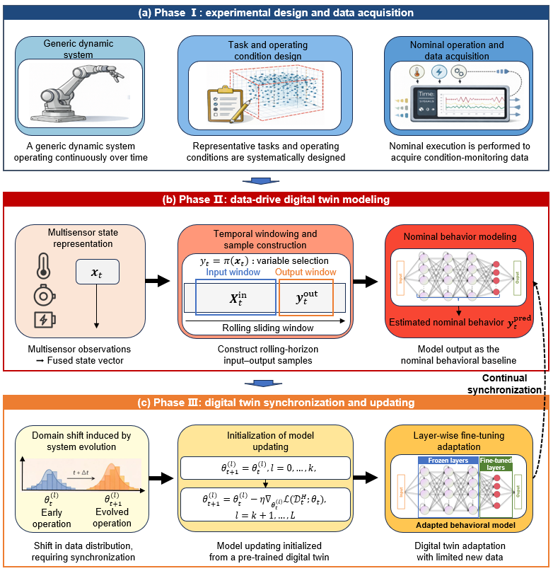
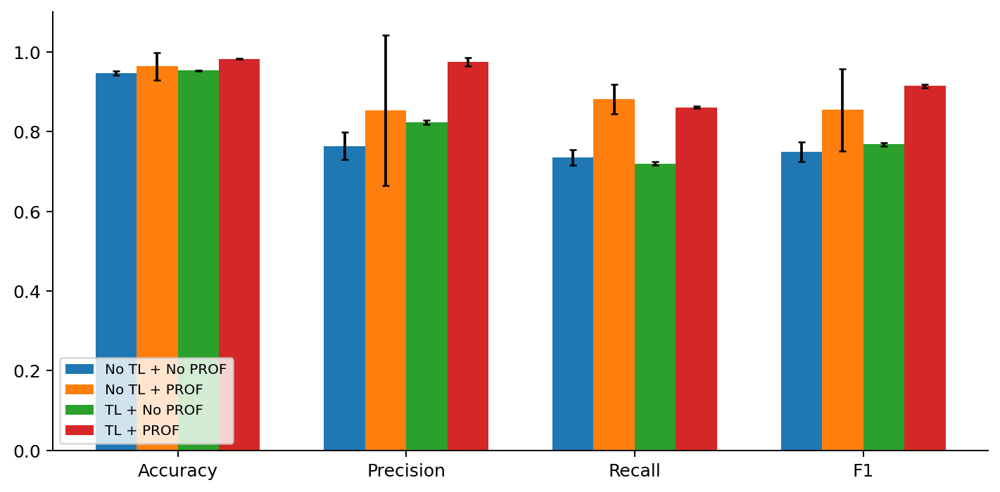

<div align="center">

# Correct-and-then-Detect
### Adaptive Fault Detection through Data-driven Digital Twins and Transfer Learning

**Haibo Li · Zhiguo Zeng · Hu Yang · Xu Li**


[Paper](paper/Fault-detection_TL_reorganized.pdf) · [Method](#method) · [Reproduce](#reproduce) · [Paper ↔ Code ↔ Results](docs/PAPER_CODE_RESULTS.md) · [Audit](docs/VALIDATION.md) · [Contributors](#contributors)



</div>

Research implementation integrating design of experiments, a rolling data-driven digital twin, transfer learning and prediction-based recursive observation feedback (PROF). The experiments use an LSTM temperature forecaster on two robotic platforms. The contribution concerns the integrated modeling, adaptation and feedback process.

## Method

1. **Design experiments** to cover the feasible pick-and-place task space.
2. **Learn a nominal digital twin** from healthy source measurements.
3. **Adapt the predictor** with healthy target data and layer freezing.
4. **Detect faults** against the immutable raw observation. PROF replaces flagged observations only in the feedback stream used by subsequent rolling windows.

Evaluation uses 30 historical observations, a 10-step forecast and the final forecast horizon. The source-calibrated threshold is 1.8 °C. Seeds 42–46 quantify target-domain variation.

## Results



Released weights reproduce all 80 target-data detection configurations, all 20 factorial configurations and the 61-threshold source validation curve. The window-sensitivity study examines history lengths of 20–60 observations and forecast horizons of 10–30 steps; its recorded experimental results and checkpoints are included. See [evaluation protocols](docs/VALIDATION.md).

## Reproduce

Use Python 3.11. Download the [data and pretrained weights](https://github.com/HelpLee/Correct-and-then-Detect/releases/download/v0.1.0/correct-and-then-detect-artifacts.zip), then extract the archive **inside this repository**, preserving its layout. It supplies evaluation data, scalers, nominal/transfer weights and the window-sensitivity experiments. Source code and the manuscript are available in this repository and the [release](https://github.com/HelpLee/Correct-and-then-Detect/releases/tag/v0.1.0).

```bash
python -m pip install -r requirements.txt
python -m unittest discover -s tests -v
python reproduce.py verify
python reproduce.py smoke
python reproduce.py full
```

`full` evaluates the nominal/transfer checkpoints and fault detectors, measures fresh inference latency and generates the result charts. The window-sensitivity figure uses the recorded experimental sweep. Results are saved under `results/generated/`; reference records and manuscript figures remain unchanged.

Individual stages: `nominal`, `detection`, `figures`, `compare`. Rendering requires generated CSVs. See [training protocols](docs/TRAINING.md) for separate fresh-training experiments; loading weights does not establish exact retraining reproduction or recreate training durations.

## Repository

```text
src/correct_detect/    windows, checkpoint models, layer freezing, PROF
scripts/              checkpoint evaluation and figure rendering
configs/              explicit scientific profiles
results/reference/    immutable detection records
results/generated/    newly computed metrics, traces and figures (ignored)
assets/               method overview and result preview
data/                 DoE and cleaned descriptive data (artifact bundle)
artifacts/            manifest and window weights (artifact bundle)
legacy/               original experiment modules and numerical references
paper/                manuscript source, bibliography, figures and PDF
tests/                temporal separation, raw observations and freezing
docs/                 provenance, mapping and audit evidence
```

The supported public evaluation entry is `reproduce.py`. Legacy modules preserve experiment provenance.

## Contributors

| Contributor | GitHub |
| --- | --- |
| Haibo Li | [@HelpLee](https://github.com/HelpLee) |
| sonic160 | [@sonic160](https://github.com/sonic160) |

## Citation and availability

Please cite the accompanying manuscript; [CITATION.cff](CITATION.cff) supplies author metadata. Code and experimental artifacts are distributed through [this repository](https://github.com/HelpLee/Correct-and-then-Detect) and its [releases](https://github.com/HelpLee/Correct-and-then-Detect/releases). See [distribution notes](docs/DISTRIBUTION.md) for artifact contents and permissions.
