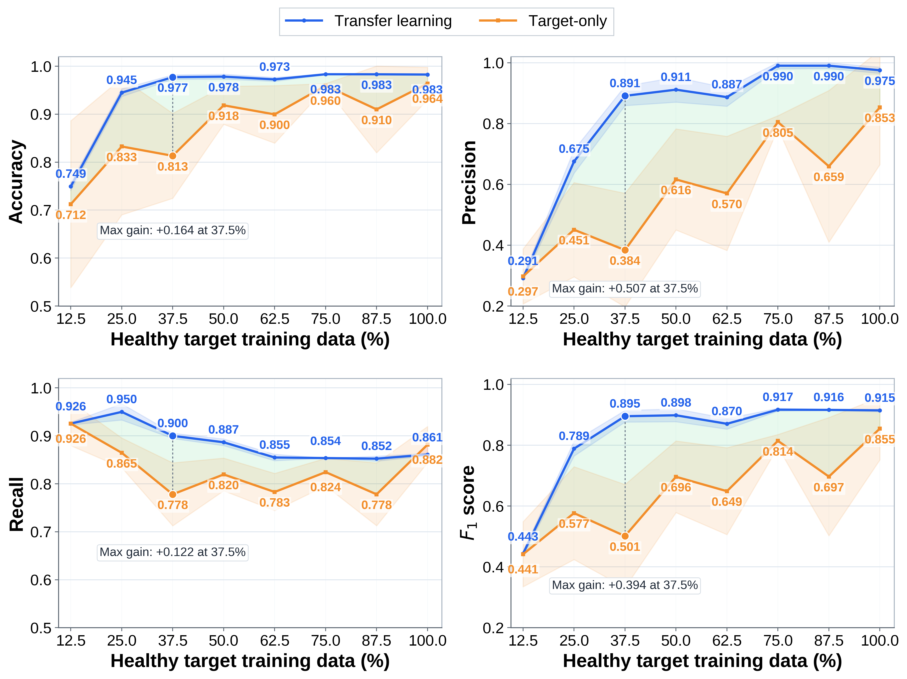

# Correct-and-then-Detect

Companion code, data and pretrained models for *Adaptive Fault Detection through Data-driven Digital Twins and Transfer Learning*.

The framework learns nominal system behavior from robot observations and uses a digital twin to generate reference predictions for residual-based fault detection. Transfer learning adapts the twin using healthy target-domain data. Prediction-based recursive observation feedback (PROF) replaces detected abnormal observations in the internal feedback buffer with nominal predictions before constructing subsequent context windows.

This repository provides the resources to reproduce nominal modeling, target-domain adaptation, residual analysis and fault-detection experiments, together with the scripts used to generate their figures.

[Data](docs/DATA.md) · [Experiments](docs/EXPERIMENTS.md) · [Training](docs/TRAINING.md) · [Validation](docs/VALIDATION.md)

## Getting started

Use Python 3.11 and install the dependencies:

```bash
python -m pip install -r requirements.txt
```

Download the [data and pretrained model bundle](https://github.com/HelpLee/Correct-and-then-Detect/releases/download/v0.1.0/correct-and-then-detect-artifacts.zip) and extract it into the repository root, preserving its directory structure. Then check the resources and run the reproduction pipeline:

```bash
python reproduce.py verify
python reproduce.py smoke
python reproduce.py full
```

The pipeline evaluates the supplied checkpoints, calculates prediction and detection metrics, generates figures and compares the results with the saved numerical references. Outputs are saved under `results/generated/`.

## Reproducing the experiments

Individual stages can also be run using the following commands:

| Experiment or stage | Command | Output |
|---|---|---|
| Nominal modeling and target-domain adaptation | `python reproduce.py nominal` | Prediction metrics, model comparisons, residual alignment and inference timing |
| Fault detection | `python reproduce.py detection` | Threshold calibration, target-data budgets and TL/PROF ablation |
| Window sensitivity | `python reproduce.py windows` | Verification of saved predictions and summary plots for 25 history/horizon combinations across three seeds |
| Figures | `python reproduce.py figures` | Experimental charts from the numerical results |
| Reference comparison | `python reproduce.py compare` | Comparison of generated metrics with saved reference values |

Run `nominal` and `detection` before generating figures or comparing results; `full` runs these stages in sequence. The window-sensitivity command can be run independently.

The detector uses a 30-step history and a direct 10-step prediction, with the last predicted output used for each residual decision. The threshold is 1.8 °C, calibrated on source validation data. PROF updates the internal feedback buffer while preserving raw observations for residual calculation. Target-domain experiments use seeds 42–46. The window-sensitivity experiment uses seeds 42–44 and evaluates every combination at the same 12,930 source validation decision times.

See [experiment details](docs/EXPERIMENTS.md) and [validation protocols](docs/VALIDATION.md) for dataset partitions, checkpoint pairing and evaluation settings. Protocol tests can be run with:

```bash
python -m unittest discover -s tests -v
```

## Training and plotting

Training entry points cover source nominal models, target-domain adaptation and window sensitivity:

```bash
python train_models.py --mode source --seeds 42
python train_models.py --mode target --seeds 42 43 44 45 46 --ratios 10 20 30 40 50 60 70 80 --freeze 0 01 012 no
python experiments/window_sensitivity/run_experiment.py --seed 42
```

For the window experiment, repeat the command with seeds 43 and 44, then generate its summaries:

```bash
python experiments/window_sensitivity/make_report.py --input-dir results/generated/window_sensitivity
```

Training saves model weights, scalers, histories and metrics under `results/generated/`. The [training guide](docs/TRAINING.md) describes the configurations and output directories.

Plotting scripts are available in `scripts/plotting/`, with numerical inputs in `results/reference/figure_data/`. Run a plotting script directly to generate its figure, or use `python reproduce.py figures` for the experiment renderer.

## Selected results

### Transfer learning and PROF


Across five seeds on the target fault test set, the combined TL/PROF configuration achieves mean F1 0.9145 with sample standard deviation 0.0045. The configuration without either component achieves mean F1 0.7493 with standard deviation 0.0245. Per-seed results and summaries are available in `results/reference/ablation_by_seed_tau1p8.csv` and `results/reference/ablation_summary_tau1p8.csv`.

### Healthy target-data budget



Detection performance at different healthy target training-data budgets, comparing transferred initialization with target-only learning. Curves and shaded bands show five-seed means and sample standard deviations. Numerical results are available in `results/reference/target_detection_by_ratio_tau1p8.csv` and its summary.

## Repository structure

```text
src/correct_detect/    window construction, models, layer freezing and PROF
configs/              experiment settings
experiments/          experiment scripts, saved results and checkpoints
scripts/              evaluation, verification and plotting
results/reference/    numerical references and figure data
results/generated/    locally generated metrics, models and figures
data/                 cleaned data and DoE points supplied in the bundle
artifacts/            checksum manifest for bundled data and models
assets/               selected result figures
legacy/               original modules and resources used by evaluation
tests/                protocol tests
docs/                 data, experiment, training and validation guides
```

## Contributors and citation

Haibo Li · Zhiguo Zeng · Hu Yang · Xu Li

GitHub: [HelpLee](https://github.com/HelpLee), [sonic160](https://github.com/sonic160).

Citation metadata is provided in [CITATION.cff](CITATION.cff). The final article citation and link will be added after publication. See [distribution notes](docs/DISTRIBUTION.md) for the resource bundle contents.
